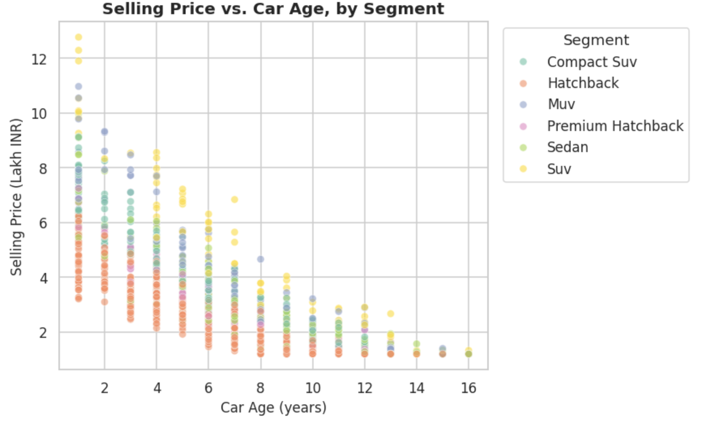
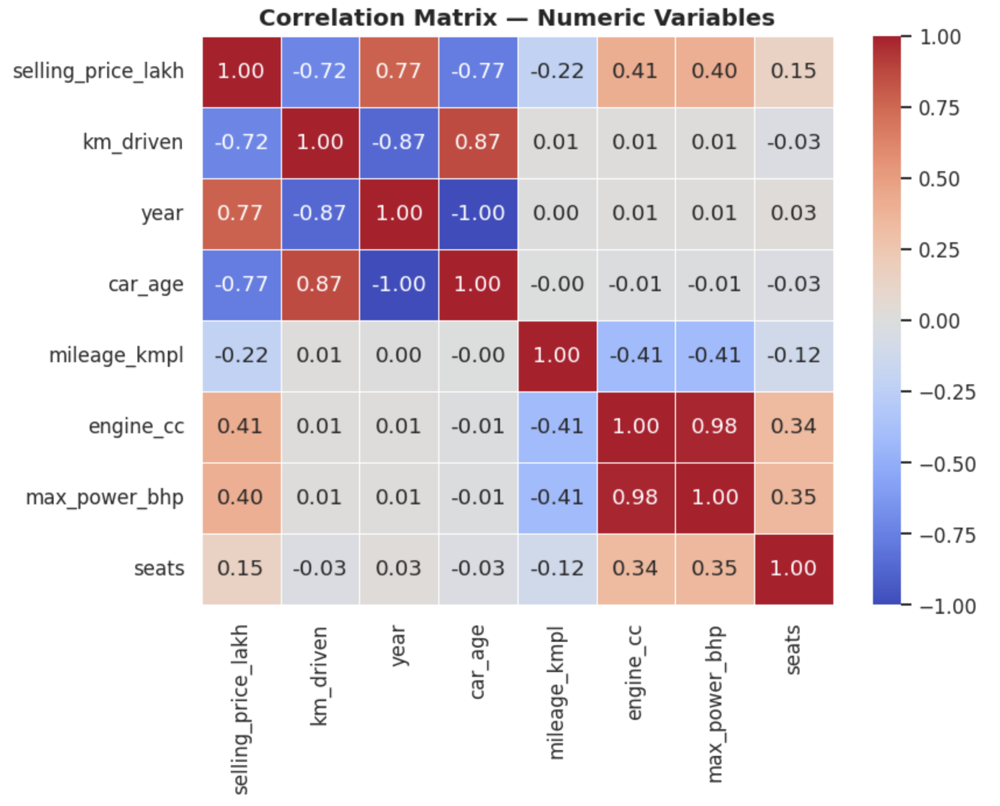
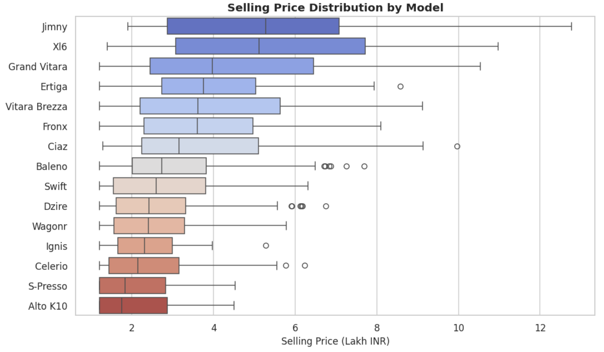

# 🚗 Suzuki Car Data Analysis

**Exploratory Data Analysis (EDA) of the Suzuki / Maruti Suzuki used-car market**


Data Analyst / Data Scientist portfolio project by **[Barna Szabó](https://github.com/barnaszabo-dev)**.

---

## Overview

A complete EDA workflow — cleaning, statistical analysis, visualization, and
business insights — applied to **1,215 used Suzuki (Maruti Suzuki) car listings**
across 15 models.

**Business question:** what actually drives resale price for Suzuki cars, and
which factors (age, mileage, ownership, fuel, transmission) are strong, reliable
pricing signals versus weak/noisy ones? The analysis is built to support real
decisions: how to price stock, which variants to prioritize, and where a simple
valuation heuristic already performs well.

> 📓 **Note:** This project includes two versions of the EDA notebook —
> [`suzuki_eda_en.ipynb`](suzuki_eda_en.ipynb) (English, main version)
> and [`Suzuki_analysis_HU.ipynb`](Suzuki_analysis_HU.ipynb) (Hungarian
> translation). Both contain identical analysis, code, and results.

## Dataset

**Synthetically generated** — a public, Suzuki-only used-car dataset isn't readily
available, so this project generates one that mirrors the schema and statistical
patterns of the well-known Kaggle *"Car Details"* dataset, restricted to real
Suzuki/Maruti Suzuki models (Swift, Baleno, Dzire, Ertiga, Vitara Brezza, Jimny,
Grand Vitara, and more), with realistic depreciation, mileage, and pricing
relationships — plus intentional data-quality issues so the cleaning section
reflects genuine work: **9 duplicate rows**, missing values in `mileage_kmpl`
(4.0%), `seats` (3.0%), `engine_cc` and `max_power_bhp` (2.0% each), inconsistent
text casing, unit-embedded strings (e.g. `"21.4 kmpl"`), and **5 outlier rows**
(e.g. `km_driven = 999999`, prices as low as 0.01 Lakh). After cleaning: **1,201
rows** remain. Generation logic: [`generate_data.py`](generate_data.py).
The qualitative patterns below are grounded in real used-car market behavior, but
exact figures shouldn't be treated as real market data.

## Tech Stack

Python 3 · Jupyter · Pandas · NumPy · Matplotlib · Seaborn · SciPy (`scipy.stats`)

## Workflow

Data generation → cleaning (duplicates, type coercion, outlier removal via IQR) →
missing-value imputation (group-wise median by model) → EDA (distributions,
descriptive stats) → correlation analysis → visualization → business insights.

## Key Findings

*(All figures below are taken directly from the notebook's output on the cleaned,
1,201-row dataset.)*

- **Car age is by far the strongest driver of resale price** (r = −0.77 with
  `car_age`, equivalently r = +0.77 with `year`) — depreciation dominates the market
  far more than any other single factor.
- **`km_driven` is the second-strongest signal** (r = −0.72), but weaker and
  noisier than age — two cars of the same age can have very different usage histories.
- **Engine size and power correlate moderately with price** (`engine_cc`: r = +0.41,
  `max_power_bhp`: r = +0.40), reflecting that larger SUV/MUV models are both
  pricier and more powerful.
- **Ownership history is a clean pricing signal** — average price drops
  monotonically: 1st owner ₹3.44L → 2nd ₹3.04L → 3rd ₹2.87L → 4th+ ₹2.21L (Lakh INR).
- **Automatic transmission carries a real price premium** — ₹4.05L average vs.
  ₹2.93L for manual — and its share is highest in Compact SUV/SUV/MUV segments (~40%
  vs. ~22–24% in hatchbacks/sedans).
- **Fuel efficiency (`mileage_kmpl`) is essentially unrelated to usage** —
  correlation with `km_driven` is r = 0.01 (p = 0.73, not significant) — efficiency
  is driven by model/fuel type, not how much the car has been driven.
- **Swift (145 listings) and Dzire (119) dominate volume**; XL6, Jimny, and Grand
  Vitara have the highest median prices (₹5.11L, ₹5.28L, ₹3.97L) but far lower volume
  (39, 37, 46 listings respectively) — a classic volume-vs-margin split.
- **Petrol dominates the fuel mix** (955 of 1,201 listings); CNG is a meaningful
  minority concentrated in hatchbacks/sedans; diesel appears only in MUV listings (11 total).

## Example Visualizations

| Price vs. Car Age | Correlation Heatmap |
|---|---|
|  |  |

| Price Distribution by Model | Distribution Overview |
|---|---|
|  |  |

## Project Structure

```
Suzuki_data_analysis/
├── README.md
├── requirements.txt
├── data/raw/suzuki_cars_raw.csv
├── notebooks/
│   ├── suzuki_eda_en.ipynb
│   └── suzuki_eda_hu.ipynb
├── src/generate_data.py
└── images/
```

## How to Run

```bash
git clone https://github.com/barnaszabo-dev/Suzuki_data_analysis.git
cd Suzuki_data_analysis
python3 -m venv venv && source venv/bin/activate   # Windows: venv\Scripts\activate
pip install -r requirements.txt
jupyter notebook notebooks/suzuki_eda_en.ipynb
```

The dataset is already included in `data/raw/`, so the notebook runs end-to-end
with no external downloads. To regenerate it: `python src/generate_data.py`.

## Future Improvements

- Baseline price-prediction model (e.g. gradient boosting) vs. the age-based heuristic
- Swap in a real Suzuki-only listings export once available
- Track listing counts/prices over time with a live marketplace feed
- Automated data-quality checks (e.g. `pandera`)

## Author

**Barna Szabó** · GitHub: [@barnaszabo-dev](https://github.com/barnaszabo-dev)

## License

MIT — see [LICENSE](LICENSE).
